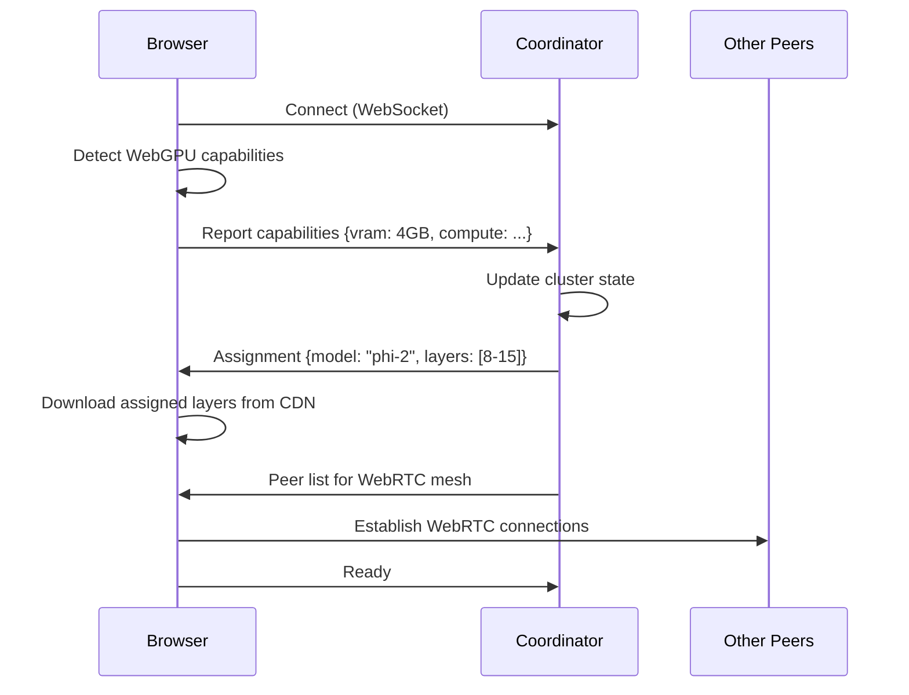
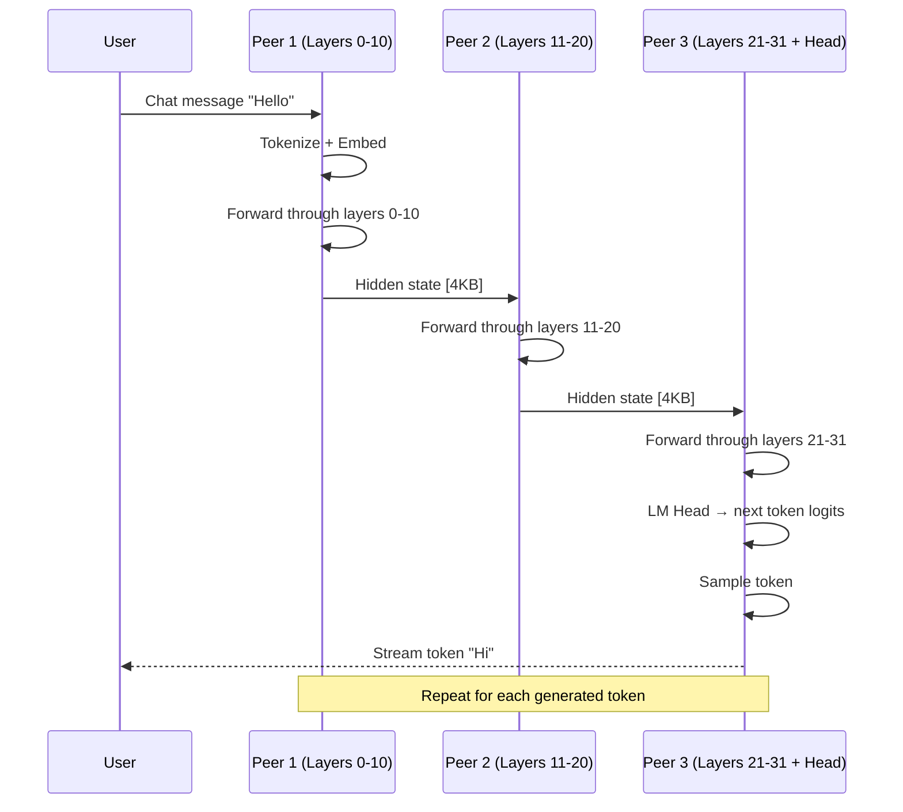

# HiveMind LLM Architecture

## Overview

HiveMind LLM implements **pipeline parallelism** across browser peers, similar to how Petals distributes model layers across GPU servers, but entirely in the browser using WebGPU.

## Key Architectural Decisions

### 1. Pipeline Parallelism (Not Tensor Parallelism)

We use **pipeline parallelism** where each peer owns complete transformer layers:

```
Pipeline Parallelism (Our Approach):
┌────────────┐    ┌────────────┐    ┌────────────┐
│ Peer A     │    │ Peer B     │    │ Peer C     │
│ Layers 0-7 │ →  │ Layers 8-15│ →  │ Layers 16+ │
│            │    │            │    │ + LM Head  │
└────────────┘    └────────────┘    └────────────┘
     Hidden states pass between peers
```

**Why not tensor parallelism?**
- Tensor parallelism splits individual matrix operations across devices
- Requires extremely low latency (microseconds) between devices
- Browser-to-browser latency is 10-100ms — far too slow for tensor parallelism
- Pipeline parallelism only needs to transfer once per layer, tolerating higher latency

### 2. WebRTC for Hidden State Transfer

Hidden states between layers are relatively small compared to model weights:

```
For a 3B model with 2048 hidden dimension, batch size 1, sequence length 512:
Hidden state size = 2048 * 512 * 2 bytes (float16) = 2MB per forward pass

For streaming (single token generation):
Hidden state size = 2048 * 1 * 2 bytes = 4KB per token
```

This is well within WebRTC's capabilities for real-time transfer.

### 3. Model Tier System

We define model tiers based on total cluster VRAM:

| Tier | Total VRAM | Model | Layers | VRAM per Peer (min) |
|------|------------|-------|--------|---------------------|
| 1 | < 4GB | SmolLM-135M | 12 | 0.5GB |
| 2 | 4-6GB | TinyLlama-1.1B | 22 | 1GB |
| 3 | 6-10GB | Phi-2 (2.7B) | 32 | 1.5GB |
| 4 | 10-16GB | Llama-3.2-3B | 28 | 2GB |
| 5 | 16GB+ | Mistral-7B-Instruct | 32 | 3GB |

### 4. Dynamic Peer Assignment

When cluster capacity changes, we have several strategies:

**On Peer Join:**
1. If new total capacity unlocks a higher tier model, initiate model upgrade
2. Otherwise, rebalance layers to include the new peer (reduces per-peer load)

**On Peer Leave:**
1. Reassign orphaned layers to remaining peers
2. If capacity drops below current tier threshold, downgrade to smaller model
3. In-flight requests complete with remaining peers before switchover

### 5. Coordinator Responsibilities

The coordinator is a lightweight Python server that handles:

1. **WebRTC Signaling**: Exchange SDP offers/answers and ICE candidates
2. **Cluster State**: Track connected peers and their capabilities
3. **Model Selection**: Determine which model tier is active
4. **Layer Assignment**: Decide which peer handles which layers
5. **Request Routing**: Direct inference requests to the correct starting peer

The coordinator does NOT:
- Run any model inference (that's all in browsers)
- Store chat history (clients manage their own state)
- Transfer hidden states (peers communicate directly via WebRTC)

## Data Flow

### Initial Connection



### Inference Request



## Component Details

### Browser Inference Engine

Each browser runs a modified WebLLM instance that:

1. Loads only assigned layers (not the full model)
2. Accepts hidden states as input (not just tokens)
3. Outputs hidden states (not just logits), except for the final peer
4. Manages KV cache for its layers

```typescript
interface InferenceEngine {
  // Load specific layers from a model
  loadLayers(modelId: string, startLayer: number, endLayer: number): Promise<void>;
  
  // Run forward pass on hidden states
  forward(
    hiddenStates: Float16Array,
    kvCache: KVCache,
    positionIds: number[]
  ): Promise<Float16Array>;
  
  // For the final peer: convert hidden states to logits
  lmHead(hiddenStates: Float16Array): Promise<Float32Array>;
  
  // Memory management
  getVRAMUsage(): number;
  unload(): Promise<void>;
}
```

### Peer Network Layer

WebRTC mesh for direct peer-to-peer communication:

```typescript
interface PeerNetwork {
  // Signaling
  connect(coordinatorUrl: string): Promise<void>;
  
  // P2P connections
  connectToPeer(peerId: string): Promise<RTCDataChannel>;
  
  // Hidden state transfer
  sendHiddenState(peerId: string, state: ArrayBuffer): Promise<void>;
  onHiddenState(callback: (peerId: string, state: ArrayBuffer) => void): void;
  
  // Coordination
  onLayerAssignment(callback: (layers: LayerRange) => void): void;
  reportCapabilities(caps: PeerCapabilities): void;
}
```

### Coordinator Server

Flask application with WebSocket support:

```python
class ClusterState:
    peers: Dict[str, PeerInfo]
    active_model: ModelConfig
    layer_assignments: Dict[str, LayerRange]
    
    def add_peer(self, peer_id: str, capabilities: PeerCapabilities) -> LayerAssignment
    def remove_peer(self, peer_id: str) -> RebalanceResult
    def get_model_for_capacity(self, total_vram: float) -> ModelConfig
```

## Challenges & Mitigations

### 1. Latency

**Challenge**: 50-200ms peer-to-peer latency impacts token generation speed.

**Mitigation**: 
- Pipeline the generation: while peer N processes token T, peer N-1 can start on token T+1
- Use speculative decoding where the smallest model predicts multiple tokens
- Batch multiple sequences to improve throughput

### 2. Peer Churn

**Challenge**: Users may close their browser mid-inference.

**Mitigation**:
- Checkpoint KV cache periodically
- Maintain 1-2 standby peers ready to take over layers
- For critical users, replicate their layers on another peer

### 3. Heterogeneous Hardware

**Challenge**: Peers have vastly different GPU capabilities.

**Mitigation**:
- Assign more layers to more powerful peers
- Use capability-weighted load balancing
- Allow underpowered peers to contribute to less demanding roles (embedding, final softmax)

### 4. Model Download Size

**Challenge**: Even sharded, models are large to download.

**Mitigation**:
- Cache layers in IndexedDB for returning users
- Use aggressive quantization (4-bit or lower)
- Progressive loading: start with smaller model, upgrade as layers download

### 5. Browser Limitations

**Challenge**: WebGPU support and VRAM access vary by browser.

**Mitigation**:
- Graceful degradation: WebGL fallback for unsupported browsers
- Clear capability detection before joining the swarm
- Minimum requirements clearly communicated to users

## Security Considerations

### Privacy of Conversations

- Hidden states contain semantic information about the input
- Peers can potentially extract meaning from hidden states they process
- **Mitigation**: For sensitive use, recommend single-peer mode or trusted swarms

### Malicious Peers

- A peer could return garbage hidden states
- **Mitigation**: Coordinator can run spot checks with known inputs
- Future: cryptographic verification of computations

### Resource Abuse

- Malicious users could join and leave to disrupt service
- **Mitigation**: Rate limiting, reputation scores, stake-based participation

## Performance Targets

| Metric | Target | Notes |
|--------|--------|-------|
| Time to first token | < 3s | Including model loading if cached |
| Tokens per second (small model) | 10-20 | Single peer, TinyLlama |
| Tokens per second (distributed) | 3-8 | Depending on peer latency |
| Hidden state transfer latency | < 100ms | P95, same region peers |
| Model tier upgrade time | < 30s | When capacity threshold crossed |
